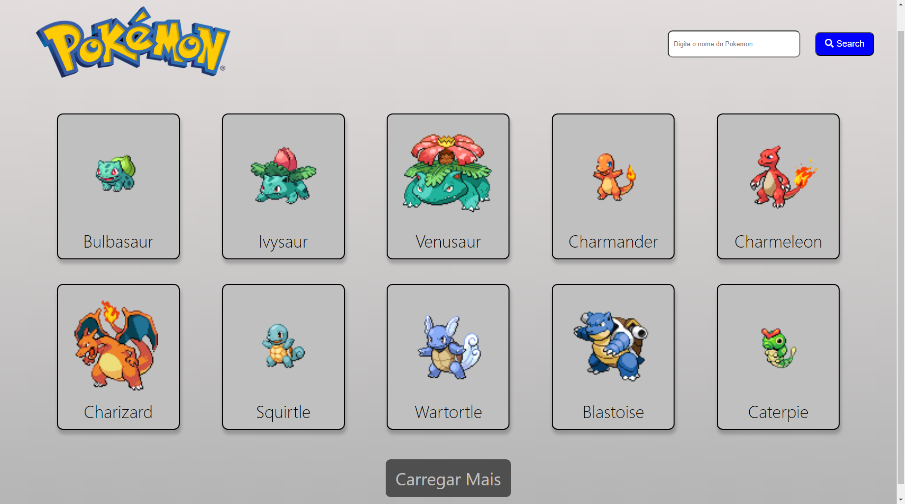

# Listagem de pokemons 😉
Esse foi um desafio proposto pelo _DevQuest_ com o objetivo de testar o conhecimento e aprendizado do react e várias outras ferramentas.

## Descrição das funcionalidades 🔩
O site possui uma listagem de 10 pokemons na página inicial, com um botão que carrega mais 10 pokemons, possui também uma barra de pesquisa de pokemons pelo tipo. Ao clicar no pokemon desejado irá ser encaminhado para uma outra página com mais detalhes sobre esse pokemon, e tendo um botao para retornar ao menu e outro para alternar entre fundo escuro ou claro.

## Principais ferramentas utilizadas 🔨 
- __React.js__ : Foi a principal ferramenta utilizada nesse projeto para a impressão da interface.

- __React-router-dom__ : Utilizado para a criação de rotas, podendo assim navegar entre as páginas.

- __Context-api__ : Utilizada para passar as informações do tema diretamente para o filho.

- __Styled-components__ : Foi utilizada para estilizar os componentes assim nçao precisando criar uma classe para cada tag necessária.

## Algumas decisões tomadas 👨‍💻
- Nos detalhes do pokemons decidi colocar um endpoint para buscar a cor do pokemon escolhido, assim podendo colocar ela no fundo do card, para ficar mais bonito.

- Coloquei todo o processo de pegar os 10 primeiros pokemons em uma função, para utliza-lo depois no botao de recarregar os pokemons ao pesquisar o seu tipo.

- Ao clicar no botao de trocar tema, decidi colocar um icone de sol para mudar pro tema claro, e uma lua para mudar pro tema escuro.

## Dificuldades ❌
Tive algumas dificuldades para utilizar os estados com a API, mas aos poucos fui entendendo melhor e dando certo. Infelizmente não consegui realizar os testes com o react.

## Como rodar o código no computador 💻

- Em uma pasta da sua escolha abra o terminal e digite
> git clone https://github.com/EduhGarcia/Listagem-Pokemon.git
- para instalar todos arquivos necessários digite
>npm install
- depois para visualizar o projeto digite
>npm start
